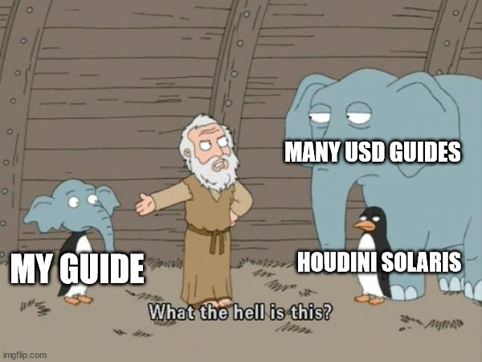
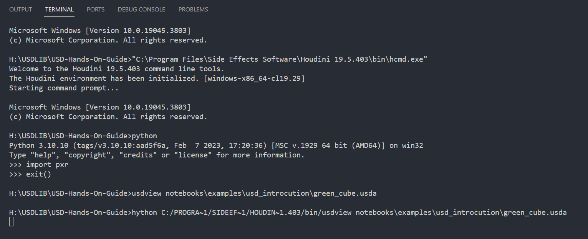
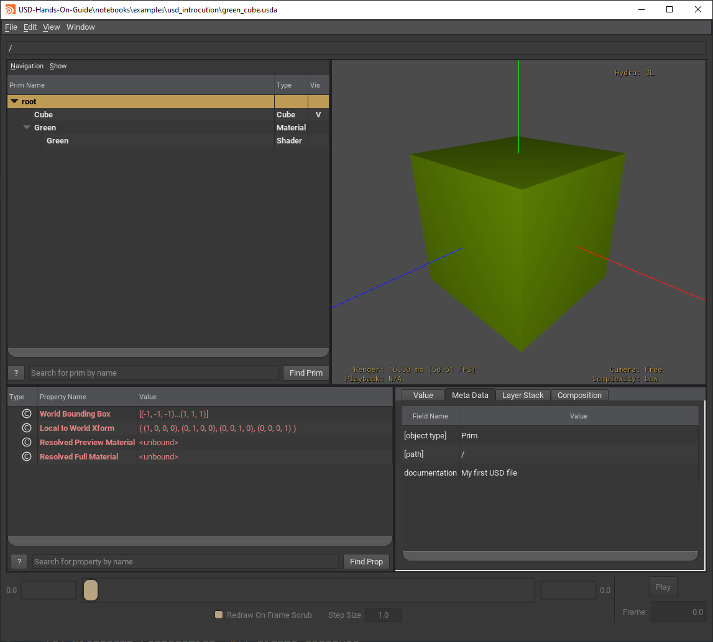
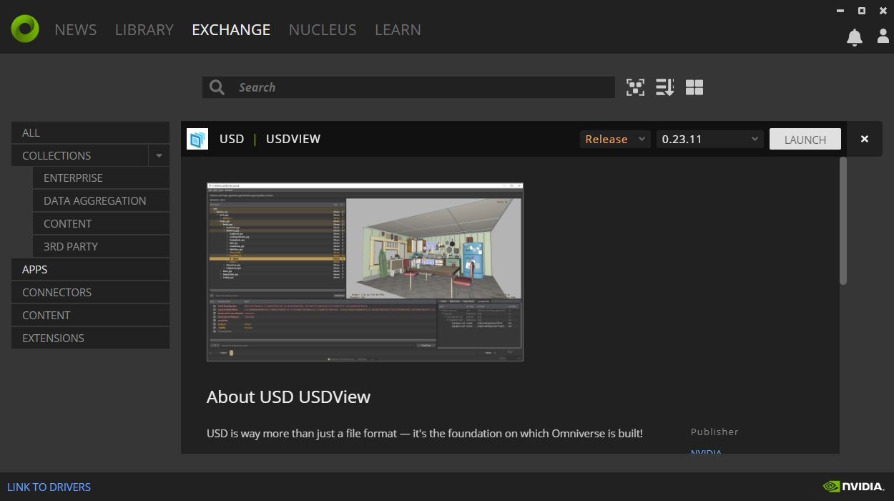

# USD Hands On Guide

This guide is a summary of several USD guides and files created by Houdini Solaris.

It aims to introduce USD in a practical way with lots of examples.



## Acknowledgement

[](https://ynput.io/)

**We create pipeline for animation and VFX you can rely on.**

Many thanks to guys at [Ynput](https://ynput.io/) for their inspiration, continuous support and encouragement.
I am proud to be part of such a great team and positive community.

## Table of contents
| Notebook | Google Colab link|
| -- | -- |
| [](notebooks/USD_Introduction.ipynb) | [](https://colab.research.google.com/github/MustafaJafar/USD-Hands-On-Guide/blob/main/notebooks/USD_Introduction.ipynb) |
| [](notebooks/USD_Beginner_Guide.ipynb) | [](https://colab.research.google.com/github/MustafaJafar/USD-Hands-On-Guide/blob/main/notebooks/USD_Beginner_Guide.ipynb) |
| [](notebooks/USD_Asset_Structure.ipynb) | [](https://colab.research.google.com/github/MustafaJafar/USD-Hands-On-Guide/blob/main/notebooks/USD_Asset_Structure.ipynb) |
| [](notebooks/Build_Assets_With_Python_1.ipynb) | [](https://colab.research.google.com/github/MustafaJafar/USD-Hands-On-Guide/blob/main/notebooks/Build_Assets_With_Python_1.ipynb) |
| [](notebooks/Build_Assets_With_Python_2.ipynb) | [](https://colab.research.google.com/github/MustafaJafar/USD-Hands-On-Guide/blob/main/notebooks/Build_Assets_With_Python_2.ipynb) |
| [](notebooks/USD_Asset_Production_Scenarios.ipynb) | [](https://colab.research.google.com/github/MustafaJafar/USD-Hands-On-Guide/blob/main/notebooks/USD_Asset_Production_Scenarios.ipynb) |

## Environment preparation: 
Below, Here's how I set up my development environment.

### Code Editing
- [VS Code](https://code.visualstudio.com/download)
- [USD Language Extension](https://marketplace.visualstudio.com/items?itemName=AnimalLogic.vscode-usda-syntax)
- Jupyter Notebook

### USD Library and Tools
You are free to use any of these options

#### I. Use USD tools embedded into your DCC
Note that, in this case you are leaning towards learning about how your DCC handles USD.

#### II. Standalone USD - Download prebuilt binaries
*   [Pre-build USD binaries](https://developer.nvidia.com/usd#libraries-and-tools) from Nvidia
*   Set Environment variables (I don't won't to set them in user or system environment, so I set them before running USD tools) e.g.
    ```
    set PATH=%PATH%;E:\USDROOT\bin;E:\USDROOT\lib;
    set PYTHONPATH=%PYTHONPATH%;E:\USDROOT\lib\python;E:\USDROOT\python\Lib; 
    ```
 
#### III. Standalone USD - Build it yourself
Good luck.
*   [OpenUSD](https://github.com/PixarAnimationStudios/OpenUSD)  

#### IV. Standalone USD - Steal Houdini's USD `<<MY FAVORITE>>`

> Because I'm a Houdini Guy, I prefer this most.

In Houdini's installation folder, there's `hcmd.exe` (Houdini command line tools)
It's command line where you have pre-configured environment which shares Houdini's environment.
> I think you might want to consider using the same version of Python as your Houdini.  
> which I'm not doing in the following screenshot.




#### V. Nvidia Omniverse

Omniverse is the first app to be built entirely around USD. It extends USD to enable live collaboration.

You can explore USD concepts and fundamentals through [Omniverse Compose](https://www.youtube.com/watch?v=_30Pf3nccuE).
Also, Omniverse provides usd tools like [`usdview`](https://www.youtube.com/watch?v=mxRnFZ9TMtc). 

> This guide mainly uses `usdview`.

Download [Nvidia Omniverse](https://www.nvidia.com/en-us/omniverse/download/), *Free for individuals*.
Then from `exchange` tab, find `usdview`.



## USD References and Dev Guides
I mainly use these links, `dir(...)` and pray for type hints.
- [OpenUsd Guide | Official](https://openusd.org/release/)
- [Omniverse Dev Guide | Nvidia](https://docs.omniverse.nvidia.com/dev-guide/latest/)
- [OpenUsd API Docs | Official](https://openusd.org/release/api/index.html)
- [Omniverse USD API Docs | Nvidia](https://docs.omniverse.nvidia.com/kit/docs/pxr-usd-api/latest/pxr.html)


## USD Learning Materials
- [Learn OpenUsd | Marco Alesiani](https://learnusd.github.io/index.html)
- [Awesome OpenUSD | Matias Codesal](https://github.com/matiascodesal/awesome-openusd)
- [Book of USD | Remedy Entertainment Plc](https://remedy-entertainment.github.io/USDBook/)
- [USD Survival Guide | Luca Scheller](https://lucascheller.github.io/VFX-UsdSurvivalGuide/index.html)
- [USD Tutorials | Pixar](https://openusd.org/release/tut_usd_tutorials.html#usd-tutorials)
- [USD: Building Asset Pipelines | Pixar](https://vimeo.com/211022588)
- [USD Fundamentals | Apple](https://developer.apple.com/videos/play/wwdc2022/10129/)
- [USD at Animal Logic Academy | ALA](https://www.youtube.com/playlist?list=PLNUaMVwYjKk8QDlM8gQSLbl8jxLRgc7d6)
- [USD-Tutorials-And-Examples | Nvidia](https://github.com/NVIDIA-Omniverse/USD-Tutorials-And-Examples)
- [Getting Started with USD | Nvidia](https://courses.nvidia.com/courses/course-v1:DLI+S-FX-02+V1/)
- [USD Basics | SideFx](https://www.sidefx.com/docs/houdini/solaris/usd.html)
- [USD in Houdini Solaris | SideFx](https://www.youtube.com/playlist?list=PLXNFA1EysfYklJkoKc-35g4SVM2YOflWD)
- [USD in Houdini 19.5 | FXPHD](https://www.fxphd.com/details/650/)
- [USD and LOPs for Houdini Artists | FXPHD](https://www.fxphd.com/details/642/)

## USD Asset Structure guides
- [Principles of Scalable Asset Structure | Nvidia](https://docs.omniverse.nvidia.com/usd/latest/learn-openusd/independent/asset-structure-principles.html#principles-of-scalable-asset-structure-in-openusd)
- [Guidelines for Structuring USD Assets | Chris Rydalch](https://wiki.aswf.io/display/WGUSD/Guidelines+for+Structuring+USD+Assets)
- [Component Builder | SideFx](https://www.sidefx.com/docs/houdini/solaris/component_builder.html)
- [ALab File Structure | ALA](https://usd-alab2.s3.amazonaws.com/documentation.html)

## USD Example Scenes
- [ALab | ALA](https://dpel.aswf.io/alab/)
- [ALab Documentation | ALA](https://usd-alab2.s3.amazonaws.com/README.html)
- [3D Assets | JCube](https://j-cube.jp/solutions/multiverse/assets/), *I prefer Esper Room!*
- [Kitchen Set | Pixar](https://openusd.org/release/dl_kitchen_set.html)
- [USD Sample Assets | Nvidia](https://developer.nvidia.com/usd#samples)